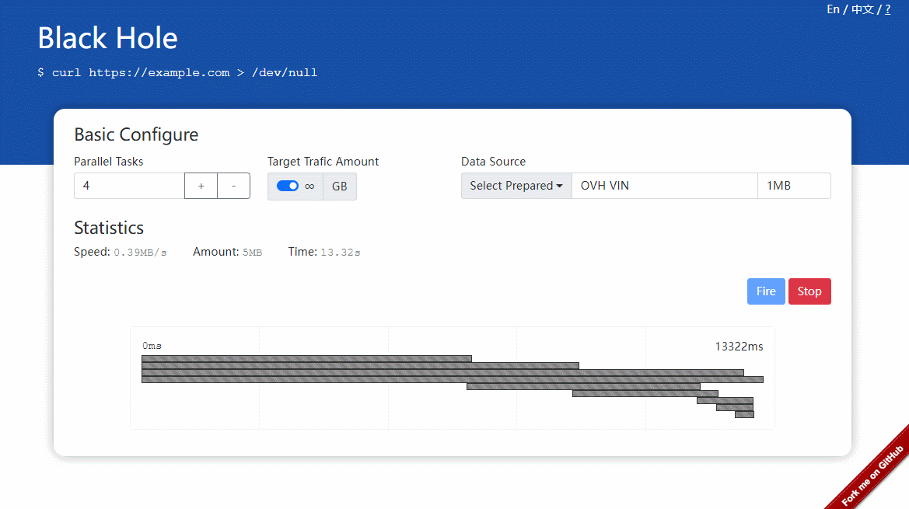

# TrafficBlackhole

[中文](./readme_cn.md) | English

In order to measure proxy service and network quality conveniently, I developed this simple project. The only function of this toy is to consume network traffic continuously, and record the statistics infomation such as speed and traffic amount.  If you are using a proxy software (like vpn, sock5/http proxy), you'll know the quality of your network.

## Notice

### It **won't** cost host provider's traffic during the test.
The interesting design is that this project uses some public looking glass service as data source, so it won't consume host provider's traffic during the test. If you want to self-host it, this is very significative.

### Don't forget turn on your proxy service
If you want to measure proxy service, add the website to your proxy list or using global proxy mode.