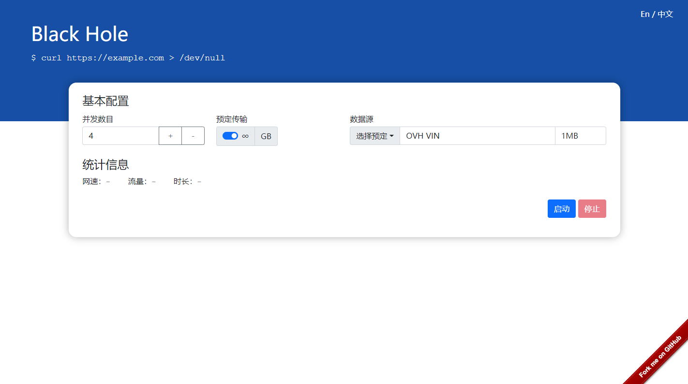

# TrafficBlackhole

中文 | [English](./readme_en.md)

为了方便测量代理服务和网络质量，我开发了这个简单的项目。这个小玩具唯一的作用就是不断消耗网络流量，记录速度、流量等统计信息。 如果使用代理软件（如 vpn、sock5/http 代理）访问改网站，就可以知道代理网络的质量如何。

## 注意

1. 测试过程中**不会**消耗网站所在服务器的流量

有趣的设计是这个项目使用了一些公共looking glass服务作为数据源，所以在测试过程中它不会消耗主机提供商的流量。 如果你想自己托管它，这一点就非常有意义。

2. 测试过程中不要忘记开代理

测试过程中不要忘记开代理，否则花费的仅是你本地网络的流量而不会消耗代理服务器的流量。