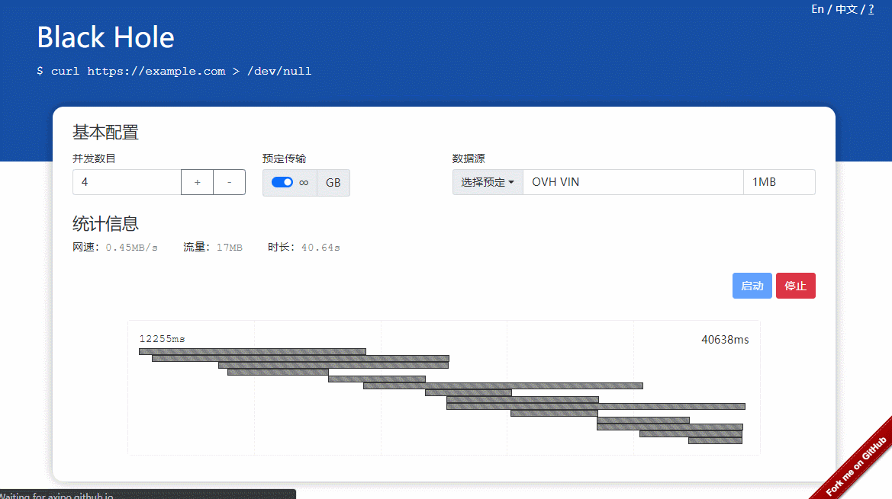

# TrafficBlackhole

   

中文 | [English](./readme.md)

为了方便测量代理服务和网络质量，我开发了这个简单的项目。这个小玩具唯一的作用就是不断消耗网络流量，记录速度、流量等统计信息。 如果使用代理软件（如 vpn、sock5/http 代理）访问该网站，就可以知道代理网络的质量如何。

**[demo website](https://axipo.github.io/TrafficBlackhole/)**

## 特点

- 纯静态网站
- 全球测速
- 支持改变并发数目
- 流量总额可控
- 流量瀑布图
- 支持自定义数据源

## 安装

克隆项目并把`docs`目录下的文件拷贝到网站服务器（如nginx）下即可，安装过程非常简单。

## 注意

### 测试过程中**不会**消耗网站所在服务器的流量

这个项目使用了一些公共 looking glass 服务作为数据源，所以在测试过程中它不会消耗主机提供商的流量。 如果你想自己托管它，这一有趣的设计就非常有意义。

### 测试过程中不要忘记开代理

测试过程中不要忘记开代理，否则花费的仅是你本地网络的流量而不会消耗代理服务器的流量。